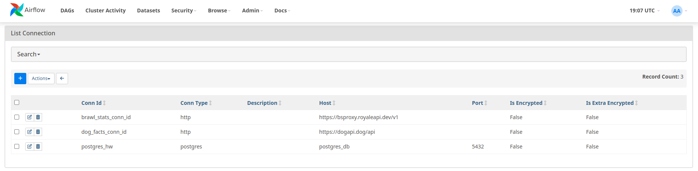
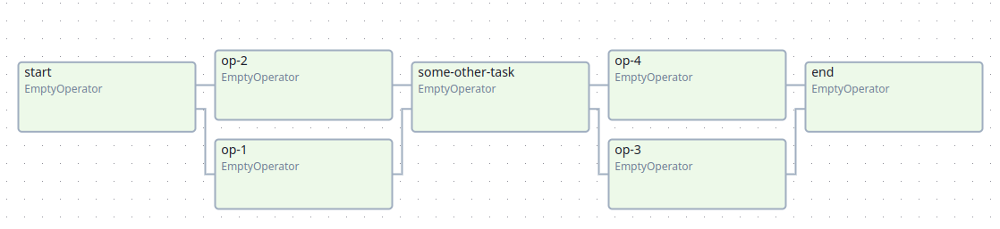
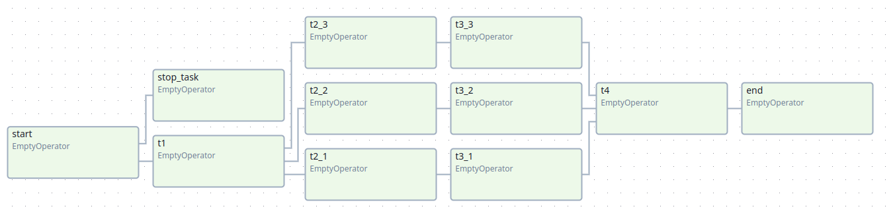
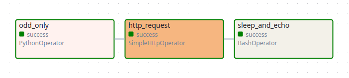

# Apache Airflow

### Запуск

Переименовать .env-template в .env
```shell
mv .env-template .env
```

Поднять airflow и postgres
```shell
cd src
docker-compose up
```

Перейти по http://127.0.0.1:8080

Настроить `connections`


* `brawl_stats_conn_id` : https://bsproxy.royaleapi.dev/v1
* `dog_facts_conn_id` : https://dogapi.dog/api
* `postgres_hw` : из `.env` файла

Запустить даги

### ДЗ

* Задание 1  


* Задание 2  


* Задание 3  


* Задание 4  
Написан кастомный оператор для BrawlStars API (🤣), который собирает информацию о кубках по `player_tag` в формате `80VGUQ009`  


* Задание 5  
Использует оператор из задания 4 и записывает информацию о кубках игрока в БД
